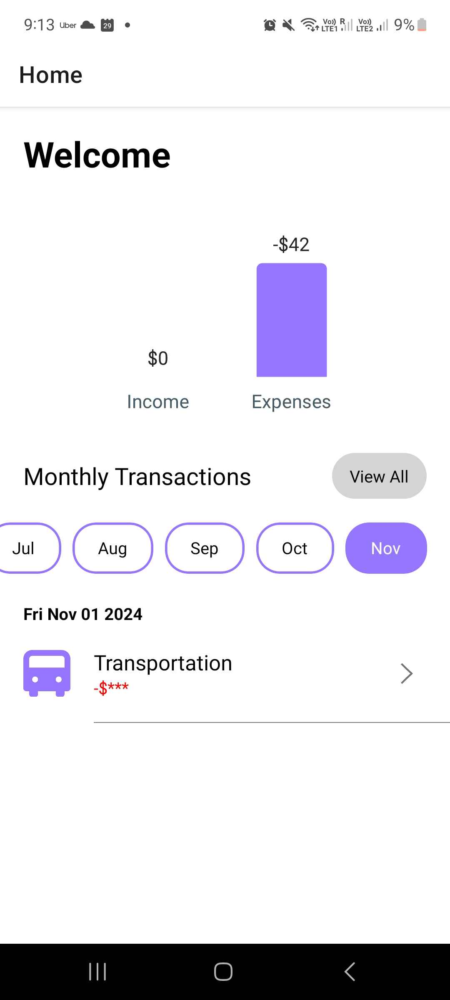
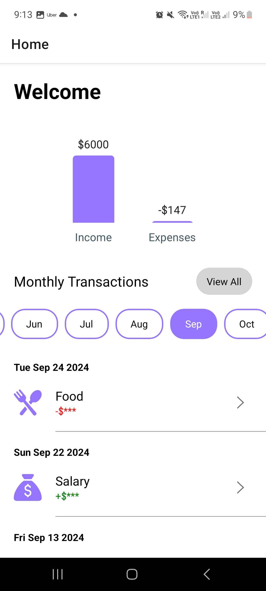
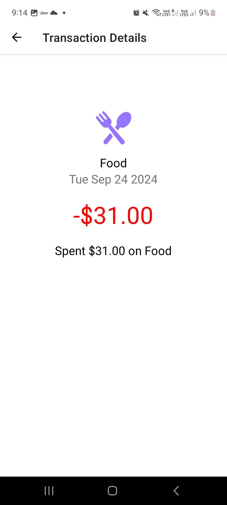
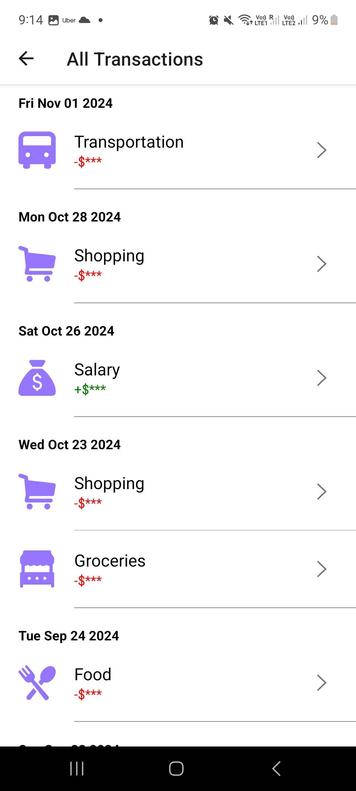

# transaction-history-module
A transaction history module in built in React Native Expo.

## Running The Project

1. Clone the Repository
2. Install Dependencies: `npm install` or `yarn install`
3. Start Metro Bundler: `npx expo start` or `yarn expo start`

## How To Test
### Android
* Start an Emulator on Android Studio
* Download Expo Go and scan the QR code after running `npx expo start`

### iOS
* Start an iOS Simulator on XCode
* Download Expo Go and scan the QR code after running `npx expo start`

### Generating New Data
1. Navigate to root project directory.
2. Run `npx tsx models/transactions.ts`.
3. 20 transactions will be generated by default, but can be modified within the file `models/transactions.ts`.

## Project Demo

1. Home Screen

After initial authentication, users can view a chart of their cash flow along with listings of their monthly transactions in the home page.  

2. Monthly Transaction History

Users may also scroll to view transactions of previous months.  

3. Transaction Details Screen

After authenticating to view sensitive information, users can view full details of the clicked transaction.  

4. All Transactions Screen

Click on the "View All" button to view the full transaction history. Refresh will be triggered upon pulling down.  

